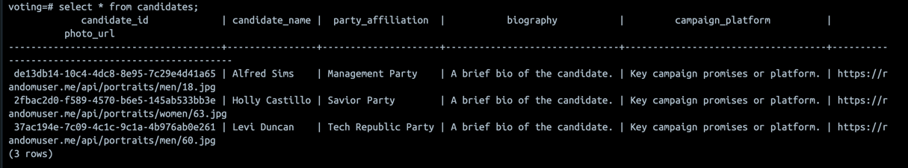

Realtime Election Voting System
===============================

This repository contains the code for a realtime election voting system. The system is built using Python, Kafka, Spark Streaming, Postgres and Streamlit. The system is built using Docker Compose to easily spin up the required services in Docker containers.

## System Architecture


## System Flow


## System Components
- **main.py**: This is the main Python script that creates the required tables on postgres (`candidates`, `voters` and `votes`), it also creates the Kafka topic and creates a copy of the `votes` table in the Kafka topic. It also contains the logic to consume the votes from the Kafka topic and produce data to `voters_topic` on Kafka.
- **voting.py**: This is the Python script that contains the logic to consume the votes from the Kafka topic (`voters_topic`), generate voting data and produce data to `votes_topic` on Kafka.
- **spark-streaming.py**: This is the Python script that contains the logic to consume the votes from the Kafka topic (`votes_topic`), enrich the data from postgres and aggregate the votes and produce data to specific topics on Kafka.
- **streamlit-app.py**: This is the Python script that contains the logic to consume the aggregated voting data from the Kafka topic as well as postgres and display the voting data in realtime using Streamlit.

## Setting up the System
This Docker Compose file allows you to easily spin up Zookkeeper, Kafka and Postgres application in Docker containers. 

### Prerequisites
- Python 3.9 or above installed on your machine
- Docker Compose installed on your machine
- Docker installed on your machine


### Steps to Run
1. Clone this repository.
2. Navigate to the root containing the Docker Compose file.
3. Run the following command:

```bash
docker-compose up -d
```
This command will start Zookeeper, Kafka and Postgres containers in detached mode (`-d` flag). Kafka will be accessible at `localhost:9092` and Postgres at `localhost:5432`.

##### Additional Configuration
If you need to modify Zookeeper configurations or change the exposed port, you can update the `docker-compose.yml` file according to your requirements.

### Running the App
1. Install the required Python packages using the following command:

```bash
pip install -r requirements.txt
```

2. Creating the required tables on Postgres and generating voter information on Kafka topic:

```bash
python main.py
```

3. Consuming the voter information from Kafka topic, generating voting data and producing data to Kafka topic:

```bash
python voting.py
```

4. Consuming the voting data from Kafka topic, enriching the data from Postgres and producing data to specific topics on Kafka:

```bash
python spark-streaming.py
```

5. Running the Streamlit app:

```bash
streamlit run streamlit-app.py
```

## Screenshots
### Candidates and Parties information

### Voters


### Voting


### Dashboard


## Video
[](https://youtu.be/X-JnC9daQxE)
